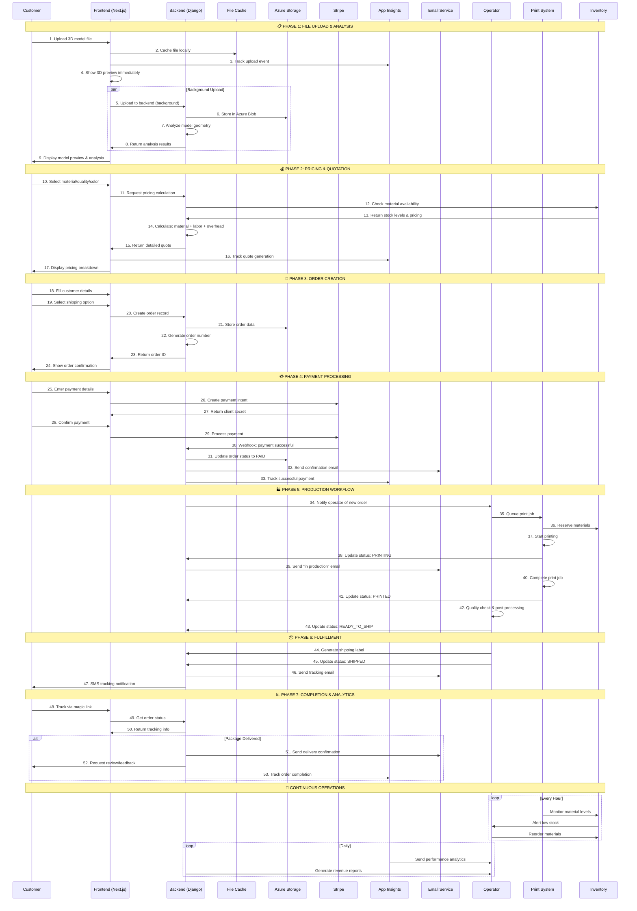
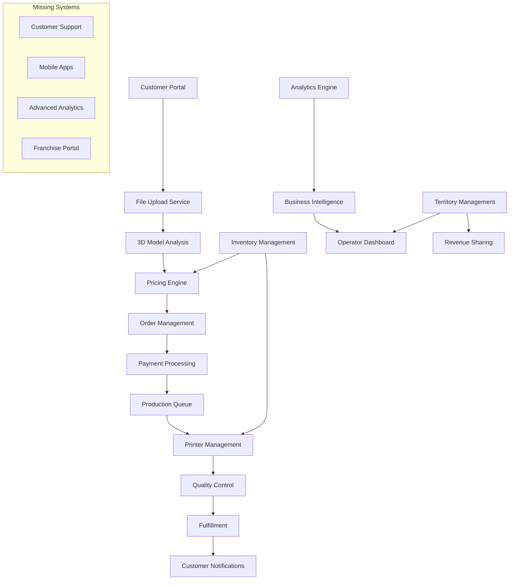

# Print3D Bay - Complete System Sequence Diagram

## 🔄 User Journey & System Interactions



## 🏗️ System Architecture Flow



## 🎯 Critical Data Flows

### Order State Machine
```
OPPORTUNITY → QUOTED → PAID → QUEUED → PRINTING → PRINTED → 
QUALITY_CHECK → READY_TO_SHIP → SHIPPED → DELIVERED → COMPLETE
```

### Material Inventory Flow
```
STOCK_AVAILABLE → RESERVED → CONSUMED → LOW_STOCK_ALERT → REORDERED → RESTOCKED
```

### Territory Revenue Flow (Future)
```
ORDER_COMPLETED → REVENUE_CALCULATION → PLATFORM_FEE → TERRITORY_PAYOUT → MONTHLY_SETTLEMENT
```
