# The Printed Bay - User Journey & System Architecture

## Complete End-to-End User Journey Sequence Diagram

```mermaid
sequenceDiagram
    participant User
    participant Frontend as Frontend (Next.js)
    participant LocalCache as Local Cache (IndexedDB)
    participant Functions as Azure Functions API
    participant BlobStorage as Azure Blob Storage
    participant Database as SQL Database
    participant Stripe as Stripe API
    participant Email as SendGrid Email

    %% Phase 1: File Upload & Analysis
    User->>Frontend: 1. Click upload area / Drop 3D file
    Frontend->>LocalCache: 2. Store file locally (instant access)
    Frontend->>Frontend: 3. Show 3D viewer immediately
    Frontend->>Functions: 4. POST /api/upload (background)
    Functions->>BlobStorage: 5. Store file with customer isolation
    Functions->>Database: 6. Insert file record with customer_id
    Functions->>Functions: 7. Analyze 3D model (geometry, volume)
    Functions->>Database: 8. Update file record with analysis
    Functions-->>Frontend: 9. Return file_id + analysis data

    %% Phase 2: Pricing & Configuration
    User->>Frontend: 10. Select material, color, quality
    Frontend->>Functions: 11. POST /api/calculate-price
    Functions->>Database: 12. Get material pricing rules
    Functions->>Functions: 13. Calculate price (volume × material × quality)
    Functions-->>Frontend: 14. Return pricing breakdown
    Frontend->>Frontend: 15. Update 3D viewer with material/color
    Frontend->>User: 16. Show live price updates

    %% Phase 3: Order Creation & Payment
    User->>Frontend: 17. Click "Order Now"
    Frontend->>Functions: 18. POST /api/create-order
    Functions->>Database: 19. Insert order record (customer_id, file_id, specs)
    Functions->>Stripe: 20. Create payment intent
    Functions-->>Frontend: 21. Return order_id + payment_intent
    Frontend->>User: 22. Show payment form (Stripe Elements)
    User->>Stripe: 23. Submit payment details
    Stripe->>Functions: 24. POST /api/webhook/stripe (payment confirmed)
    Functions->>Database: 25. Update order status = 'paid'
    Functions->>Email: 26. Send order confirmation email
    Functions-->>Frontend: 27. Payment success response

    %% Phase 4: Order Management & Tracking
    Frontend->>User: 28. Show order confirmation
    User->>Frontend: 29. Access "My Orders" section
    Frontend->>Functions: 30. GET /api/orders (customer-specific)
    Functions->>Database: 31. Query orders WHERE customer_id = user_id
    Functions->>BlobStorage: 32. Get file URLs (with SAS tokens)
    Functions-->>Frontend: 33. Return customer's orders only
    Frontend->>User: 34. Display orders (CRUD - no delete)

    %% Phase 5: Order Status Updates (Admin/System)
    Functions->>Database: 35. Admin updates order status
    Functions->>Email: 36. Send status update email
    Functions->>Frontend: 37. Real-time status updates (if connected)
```



## Key System Components & Data Isolation

### 1. **Customer Data Isolation**
```
Customer A:
├── BlobStorage: /customers/{customer_a_id}/files/
├── Database: WHERE customer_id = 'customer_a_id'
└── Orders: customer_a can only see their own orders

Customer B:
├── BlobStorage: /customers/{customer_b_id}/files/  
├── Database: WHERE customer_id = 'customer_b_id'
└── Orders: customer_b can only see their own orders
```

### 2. **Database Schema (Expected)**
```sql
-- Files table
CREATE TABLE files (
    id UNIQUEIDENTIFIER PRIMARY KEY,
    customer_id NVARCHAR(255) NOT NULL,
    filename NVARCHAR(255),
    blob_url NVARCHAR(500),
    file_size BIGINT,
    analysis_data NVARCHAR(MAX), -- JSON
    created_at DATETIME2 DEFAULT GETDATE()
);

-- Orders table  
CREATE TABLE orders (
    id UNIQUEIDENTIFIER PRIMARY KEY,
    customer_id NVARCHAR(255) NOT NULL,
    file_id UNIQUEIDENTIFIER REFERENCES files(id),
    status NVARCHAR(50) DEFAULT 'pending',
    material NVARCHAR(100),
    color NVARCHAR(50),
    quality NVARCHAR(50),
    pricing_data NVARCHAR(MAX), -- JSON
    stripe_payment_intent_id NVARCHAR(255),
    created_at DATETIME2 DEFAULT GETDATE(),
    updated_at DATETIME2 DEFAULT GETDATE()
);
```

### 3. **Required Environment Variables**
```env
# Azure Functions
AZURE_STORAGE_CONNECTION_STRING=...
AZURE_STORAGE_CONTAINER_NAME=customer-files

# Database  
SQL_CONNECTION_STRING=Server=...;Database=...;

# Stripe
STRIPE_PUBLIC_KEY=pk_...
STRIPE_SECRET_KEY=sk_...
STRIPE_WEBHOOK_SECRET=whsec_...

# SendGrid
SENDGRID_API_KEY=SG...
SENDGRID_FROM_EMAIL=orders@theprintedbay.com

# Application Insights
APPLICATIONINSIGHTS_CONNECTION_STRING=...
```

## Current Issues to Fix

1. **Environment Message**: Update to reflect Functions requirement
2. **Functions Not Running**: `npm run dev` only runs frontend
3. **End-to-End Flow**: Connect all services properly
4. **Customer Isolation**: Implement proper data separation
5. **CRUD Operations**: Customer can view/update their orders (no delete)

## Next Steps Priority

1. ✅ Fix file upload (working now)
2. 🔧 Start Azure Functions locally alongside frontend  
3. 🔧 Verify all environment variables
4. 🔧 Test complete upload → blob storage → database flow
5. 🔧 Implement customer-specific data isolation
6. 🔧 Build order management UI with proper CRUD
